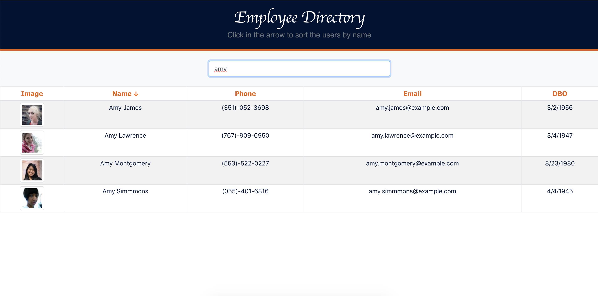
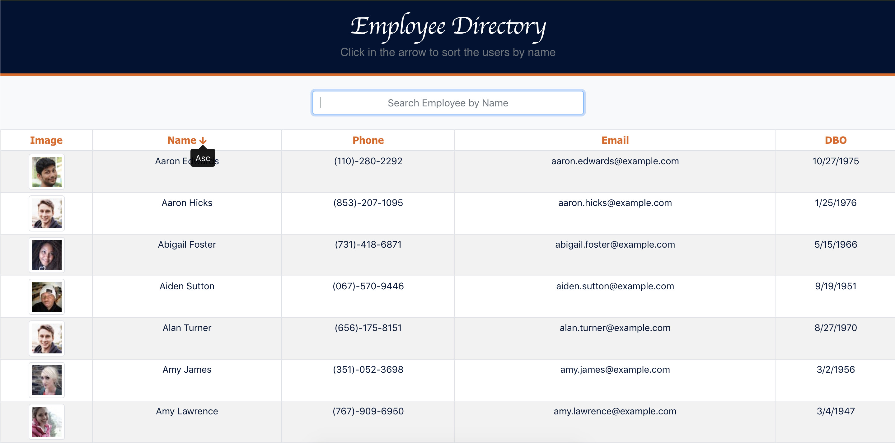
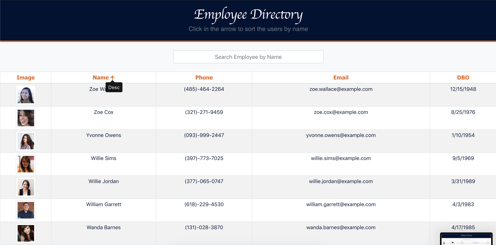

# Employee Directory

### Table of Contents

- [Project Description](#project-description)
- [User Stories](#user-stories)
- [Acceptance Criteria](#acceptance-criteria)
- [Application MVP](#application-mvp)
- [Installation](#installation)
- [Technologies](#technologies)
- [Dependencies](#depencencies)
- [Reference Links](#reference-links)
  - [Employee Directory Application Live Link](https://employee-directory-platform.herokuapp.com/)
  - [Employee Directory Application GitHub Repo](https://github.com/ystamaritq/employee-directory)
  - [Employee Directory Project Board](https://github.com/ystamaritq/employee-directory/projects/1)
- [App Demo](#app-demo)

---

## Project Description

Employee directory using React. An employee or manager would benefit greatly from being able to view non-sensitive data about other employees. It would be particularly helpful to be able to filter employees by name.

---

## User Stories

```
As a user,
I want to be able to view my entire employee directory at once
So that I have quick access to their information

```

## Acceptance Criteria

Based on _random users_ free **API** `https://randomuser.me/api/?results=200&nat=us` that randomly generated users when the user loads the page, a table of employees will be render.

#### Random Users API

**Random Users API** allows to be used as placeholders. The API can return multiple results, as well as specify generated user details such as gender, email, image, username, address, title, first and last name, and more.

<details>
  <summary>reference user api image (click to expand)</summary>

</details>

---

## Application MVP

- The user can **sort** the table by at least one category
  - table sort by: **name** _asc_ & _desc_
- The user can **filter** by at least one property
  - filter by **name**

---

## Installation

Follow the installation instructions in order to successfully test this application

#### Installation Instructions

**Steps**

## -

## -

## Technologies

Here is a list of all technologies used to develop this platform.

- `Node.js - An asynchronous event-driven JavaScript runtime`
- `React.js - A JavaScript library for building user interfaces`
- `Code Climate - Provides automated code review for test coverage, maintainability and more so that you can save time and merge with confidence`
- `CircleCI - A modern continuous integration and continuous delivery (CI/CD) platform that automates build, test, and deployment of software.`
- `Heroku - A platform as a service (PaaS) that enables to build, run, and operate applications entirely in the cloud.`

## Dependencies

The dependencies listed below are all dependecies used by the App.

- `@fortawesome` : Build and manage icons and typefaces in a single place, then serve them with a single line of code.
  - `@fortawesome/fontawesome-svg-core`
  - `@fortawesome/free-solid-svg-icons`
  - `@fortawesome/react-fontawesome`
- `@testing-library` : A very light-weight solution for testing React components. It provides light utility functions on top of react-dom and react-dom/test-utils, in a way that encourages better testing practices.
  - `@testing-library/jest-dom`
  - `@testing-library/react`
  - `@testing-library/user-event`
- `axios` : Promise based HTTP client for the browser and node.js.
- `react-bootstrap` : The most popular front-end framework.
- `react-dom` : The entry point to the DOM and server renderers for React. It is intended to be paired with the generic React package, which is shipped as react to npm.
- `react-scripts` : Includes scripts and configuration used by Create React App.

  - bellow is a list of the react-scripts using by the App:

  ```
    "start": "react-scripts start",
    "build": "react-scripts build",
    "test": "react-scripts test",
    "eject": "react-scripts eject"

  ```

<details>
  <summary>reference package json image (click to expand)</summary>

</details>

---

## Reference Links

- Link to Employee Directory Applications **deployed on Heroku** - [Employee Directory Application Live Link](https://employee-directory-platform.herokuapp.com/)

- Link to **GitHub Repo** used for application development - [Employee Directory Application GitHub Repo](https://github.com/ystamaritq/employee-directory)

- Link to **project board** used for application development - [Project Board](https://github.com/ystamaritq/employee-directory/projects/1)

---

## App Demo


[Try it out!](https://employee-directory-platform.herokuapp.com/)

The following images demonstrates the application functionality:

<details>
<summary>Employee Directory Demo Images (click to expand)</summary>




</details>

---

[Table of Contents](#table-of-contents)
